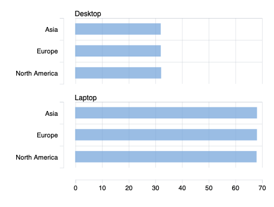

# Sustainability Impact Analysis for Intel

## Project Overview
SQL data analysis project evaluating Intel’s device repurposing program. Uses joins, aggregations, and CASE statements to analyze device lifecycle data, energy savings, and CO₂ reduction impact. Note: This project uses an educational dataset from the Global Career Accelerator SQL program inspired by Intel’s sustainability initiatives.

## Dataset

Two datasets were used:

device_data
- device_id
- device_type
- model_year

impact_data
- device_id
- energy_savings_yr
- co2_saved_kg_yr
- region
- usage_purpose

These datasets were joined to analyze device age, energy savings, and environmental impact.

## Tools Used
- SQL
- Joins
- CTEs
- Aggregations
- CASE statements

## Key Analysis

### Device Age Calculation
Calculated device age using model_year to analyze sustainability impact across device lifecycle.

### Device Age Buckets
Created age groups using CASE statements:
- newer
- mid-age
- older

### Environmental Impact Metrics
Calculated:
- total repurposed devices
- average device age
- average annual energy savings
- total CO₂ emissions saved

Intel repurposed **601,740 devices in 2024**. 

### Regional Impact
Compared environmental benefits across:
- North America
- Europe
- Asia

Regions with higher fossil fuel electricity generation showed larger CO₂ reduction impact.

## Key Insights

- Older devices generate higher energy savings per device
- Laptops contribute the largest share of sustainability impact
- Regions with higher carbon intensity benefit more from repurposing

## Business Recommendation

Intel should prioritize repurposing:
- older devices
- laptops
- regions with higher carbon intensity

This strategy maximizes energy savings and CO₂ reductions while optimizing sustainability outcomes.

## Visualization

Device type contribution to energy savings and CO₂ reduction by region.

